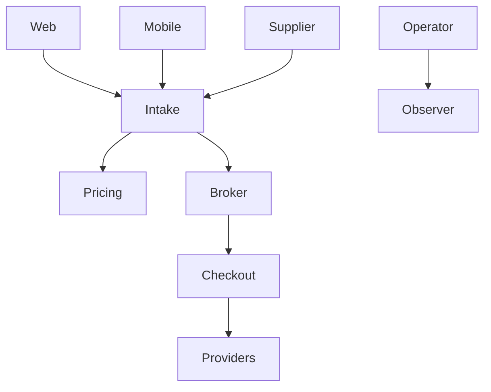
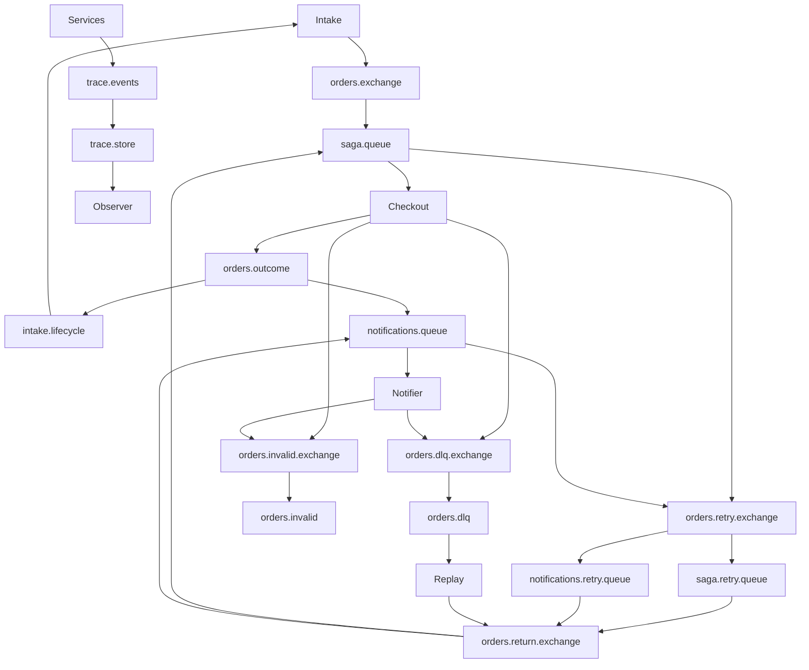

# Order integration

## System context

```mermaid
flowchart TD
  Web --> Intake
  Mobile --> Intake
  Supplier --> Intake
  Intake --> Pricing
  Intake --> Broker
  Broker --> Checkout
  Checkout --> Providers
  Operator --> Observer
```

## Integration architecture

```mermaid
flowchart TD
  Intake --> A[orders.exchange] --> S[saga.queue] --> Checkout
  Checkout --> O[orders.outcome]
  O --> L[intake.lifecycle] --> Intake
  O --> N[notifications.queue] --> Notifier
  S --> R[orders.retry.exchange]
  N --> R
  R --> SR[saga.retry.queue] --> RT[orders.return.exchange]
  R --> NR[notifications.retry.queue] --> RT
  RT --> S
  RT --> N
  Checkout --> D[orders.dlq.exchange]
  Notifier --> D
  D --> DL[orders.dlq] --> Replay --> RT
  Checkout --> I[orders.invalid.exchange]
  Notifier --> I
  I --> IQ[orders.invalid]
  Services --> T[trace.events] --> TS[trace.store] --> Observer
```
